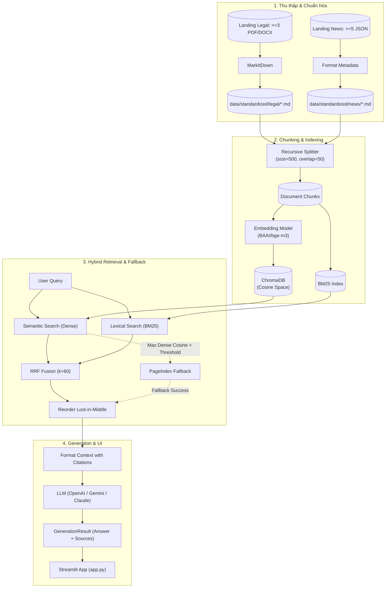

# Kế Hoạch & Danh Sách Task Dự Án — RAG Pipeline (Day 8)

Tài liệu quản lý tiến độ, phân chia đầu mục công việc và tiêu chuẩn nghiệm thu kỹ thuật cho bài tập nhóm xây dựng hệ thống **RAG Pipeline (Hybrid Search + Fallback + Citation + Streamlit Chatbot + Ragas Evaluation)**.

---

## 1. Tổng Quan & Kiến Trúc Luồng Hệ Thống



---

## 2. Bảng Theo Dõi Tiến Độ Theo Từng Đầu Mục

### Giai đoạn 1: Chuẩn bị Môi trường & Lựa chọn Đề tài
- [ ] **Task 0.1: Phân chia vai trò & Chọn chủ đề**
  - **Mô tả:** Lựa chọn chủ đề từ [`docs/SUGGESTED_TOPICS.md`](docs/SUGGESTED_TOPICS.md) (hoặc đề tài tự chọn có đủ nguồn quy định & bài viết công khai).
  - **Phân công:** Toàn nhóm.
  - **Trạng thái:** Chưa thực hiện.
- [ ] **Task 0.2: Cài đặt môi trường & Playwright**
  - **Mô tả:** Tạo virtual environment, cài đặt dependencies và trình duyệt Chromium cho crawler.
  ```powershell
  python -m venv .venv
  .venv\Scripts\activate
  python -m pip install -e ".[dev]"
  python -m playwright install chromium
  ```
  - **Trạng thái:** Chưa thực hiện.
- [ ] **Task 0.3: Thiết lập cấu hình `.env`**
  - **Mô tả:** Copy `.env.example` sang `.env`, điền API key cần dùng (OpenAI / Gemini / Anthropic, PageIndex, Jina nếu có).
  - **Lưu ý:** Tuyệt đối không commit file `.env`.
  - **Trạng thái:** Chưa thực hiện.

---

### Giai đoạn 2: Thu thập & Chuẩn hóa Dữ liệu (10 Điểm Rubric)
- [x] **Task 1: Thu thập tài liệu quy định/pháp lý**
  - **File:** [`src/task1_collect_legal_docs.py`](src/task1_collect_legal_docs.py)
  - **Yêu cầu:**
    - Tải tối thiểu **3 file** `.pdf`, `.doc` hoặc `.docx` từ nguồn công khai.
    - Lưu vào thư mục `data/landing/legal/`.
    - Dung lượng mỗi file bắt buộc **> 1024 bytes** (1KB).
  - **Kiểm thử:** `pytest tests/test_acceptance.py -k test_corpus_has_required_legal_documents`
  - **Người phụ trách:** ____________________ | **Trạng thái:** Đã hoàn thành (Có 3 file DOCX hợp lệ).

- [x] **Task 2: Crawl bài viết/tin tức**
  - **File:** [`src/task2_crawl_news.py`](src/task2_crawl_news.py)
  - **Yêu cầu:**
    - Crawl tối thiểu **5 bài viết/tin tức** từ các URL công khai qua Crawl4AI (hoặc công cụ quen thuộc).
    - Lưu thành từng file JSON riêng rẽ vào `data/landing/news/` (ví dụ `article_01.json`).
    - Bắt buộc chứa đủ 4 trường: `url`, `title`, `date_crawled`, `content_markdown`.
  - **Kiểm thử:** `pytest tests/test_acceptance.py -k test_corpus_has_required_news_with_metadata`
  - **Người phụ trách:** ____________________ | **Trạng thái:** Đã hoàn thành (Passed acceptance test).

- [x] **Task 3: Chuẩn hóa toàn bộ sang Markdown**
  - **File:** [`src/task3_convert_markdown.py`](src/task3_convert_markdown.py)
  - **Yêu cầu:**
    - Dùng `MarkItDown` convert legal docs sang `data/standardized/legal/*.md`.
    - Convert news JSON sang `data/standardized/news/*.md` (chèn header có Title, Source, Date Crawled).
    - Đảm bảo mỗi file Markdown sau chuẩn hóa có độ dài **$\ge$ 200 ký tự**.
  - **Kiểm thử:** `pytest tests/test_acceptance.py -k test_standardized_output_covers_both_source_types`
  - **Người phụ trách:** ____________________ | **Trạng thái:** Đã hoàn thành (Passed acceptance test).

---

### Giai đoạn 3: Chunking, Embedding & Indexing (10 Điểm Rubric)
- [x] **Task 4: Xây dựng Module Chunking & Vector Database**
  - **File:** [`src/task4_chunking_indexing.py`](src/task4_chunking_indexing.py)
  - **Các hàm cần hoàn thiện:**
    1. `load_documents() -> list[dict]`: Đọc toàn bộ `.md` trong `data/standardized/`, tạo dict Document (`id`, `content`, `metadata`).
    2. `chunk_documents(documents) -> list[dict]`: Dùng `RecursiveCharacterTextSplitter` (`chunk_size=500`, `chunk_overlap=50`). Sinh `id` ổn định `{doc_id}::chunk-{index}` và gán `chunk_index` (int $\ge 0$).
    3. `embed_texts(texts: list[str]) -> list[list[float]]`: Embed text thành vector bằng OpenAI embedding API (`text-embedding-3-small`), tự động loại bỏ khoảng trắng thừa.
    4. `embed_chunks(chunks) -> list[dict]`: Gán trường `embedding` vào từng chunk.
    5. `get_collection()`: Mở persistent collection ChromaDB tại `chroma_db/` với khoảng cách cosine (`{"hnsw:space": "cosine"}`).
    6. `index_to_vectorstore(chunks)`: Upsert danh sách chunk vào ChromaDB để tránh trùng dữ liệu khi chạy lại.
  - **Kiểm thử:** `pytest tests/test_contracts.py -k test_chunk_documents_preserves_identity_and_metadata`
  - **Người phụ trách:** ____________________ | **Trạng thái:** Đã hoàn thành (Indexed 2,305 chunks vào ChromaDB).

---

### Giai đoạn 4: Hybrid Search & RRF Fusion (20 Điểm Rubric)
- [ ] **Task 5: Dense Semantic Search**
  - **File:** [`src/task5_semantic_search.py`](src/task5_semantic_search.py)
  - **Yêu cầu:**
    - Sử dụng chung hàm `embed_texts()` từ Task 4 để embed query.
    - Query ChromaDB lấy top $k$, chuyển đổi cosine distance thành cosine similarity score: `score = max(0.0, 1.0 - distance)`.
    - Trả về danh sách `SearchResult` có `retrieval_method="dense"`, sắp xếp score giảm dần, không quá `top_k`.
  - **Kiểm thử:** `pytest tests/test_contracts.py -k test_semantic_search_uses_shared_embedding_and_contract`
  - **Người phụ trách:** ____________________ | **Trạng thái:** Chưa thực hiện.

- [ ] **Task 6: Lexical Search bằng BM25**
  - **File:** [`src/task6_lexical_search.py`](src/task6_lexical_search.py)
  - **Yêu cầu:**
    - Xây dựng index `BM25Okapi` trên cùng tập corpus chunks của Task 4.
    - Tokenize query, tính điểm và map về các chunks tương ứng.
    - Trả về danh sách `SearchResult` có `retrieval_method="bm25"`, score giảm dần, loại bỏ các kết quả có score $\le 0$.
  - **Kiểm thử:** `pytest tests/test_contracts.py -k test_lexical_search_returns_bm25_contract`
  - **Người phụ trách:** ____________________ | **Trạng thái:** Chưa thực hiện.

- [ ] **Task 7: Reciprocal Rank Fusion (RRF)**
  - **File:** [`src/task7_reranking.py`](src/task7_reranking.py)
  - **Yêu cầu:**
    - Hợp nhất các ranked list theo công thức: $\text{RRF}(d) = \sum_{l} \frac{1}{k + \text{rank}_l(d)}$ với $k=60$, rank bắt đầu từ 1.
    - Gộp trùng theo `id`, gán `retrieval_method="hybrid"`, gán lại score RRF mới và sắp xếp giảm dần.
  - **Kiểm thử:** `pytest tests/test_contracts.py -k test_rrf_uses_rank_deduplicates_and_marks_hybrid`
  - **Người phụ trách:** ____________________ | **Trạng thái:** Chưa thực hiện.

---

### Giai đoạn 5: Fallback & Retrieval Pipeline (10 Điểm Rubric)
- [ ] **Task 8: Vectorless Search Fallback qua PageIndex**
  - **File:** [`src/task8_pageindex_vectorless.py`](src/task8_pageindex_vectorless.py)
  - **Yêu cầu:**
    - Đọc `PAGEINDEX_API_KEY` từ `.env`, upload tài liệu và cache document IDs.
    - Query trả về danh sách `SearchResult` có `retrieval_method="pageindex"`.
    - Bọc `try-except` cẩn thận để bắt lỗi timeout/mạng, không làm gián đoạn pipeline.
  - **Người phụ trách:** ____________________ | **Trạng thái:** Chưa thực hiện.

- [ ] **Task 9: Retrieval Pipeline Hoàn Chỉnh**
  - **File:** [`src/task9_retrieval_pipeline.py`](src/task9_retrieval_pipeline.py)
  - **Quy trình chuẩn:**
    1. Chạy song song/tuần tự `semantic_search` và `lexical_search`.
    2. Fuse hai danh sách bằng `rerank_rrf` đúng một lần.
    3. Lấy điểm **cosine score gốc cao nhất của dense search** (`best_dense_score`).
    4. Nếu `best_dense_score < score_threshold` $\rightarrow$ kích hoạt fallback `pageindex_search`.
    5. Nếu fallback gặp sự cố ngoại lệ $\rightarrow$ trả về kết quả hybrid an toàn thay vì gây crash.
  - **Kiểm thử:**
    - `pytest tests/test_contracts.py -k test_retrieve_uses_dense_score_for_fallback`
    - `pytest tests/test_contracts.py -k test_retrieve_fuses_once_when_dense_is_confident`
    - `pytest tests/test_contracts.py -k test_retrieve_survives_fallback_provider_error`
  - **Người phụ trách:** ____________________ | **Trạng thái:** Chưa thực hiện.

---

### Giai đoạn 6: Generation có Trích Dẫn & Safe Refusal (15 Điểm Rubric)
- [ ] **Task 10: Sinh Câu Trả Lời & Trích Dẫn Nguồn**
  - **File:** [`src/task10_generation.py`](src/task10_generation.py)
  - **Các hàm cần hoàn thiện:**
    1. `reorder_for_llm(chunks)`: Sắp xếp lại chunk theo dạng xen kẽ (front: chunks[::2], back: chunks[1::2][::-1]) để giảm hiện tượng lost-in-the-middle, bảo toàn id.
    2. `format_context(chunks)`: Đóng gói context có gắn nhãn `[Document i | Title: ... | Source: ...]`.
    3. `call_llm(system_prompt, user_message)`: Gọi LLM theo provider cấu hình trong `.env` (`openai`, `gemini`, `anthropic`).
    4. `generate_with_citation(query, top_k)`:
       - Nếu không có chunk hoặc context không có bằng chứng $\rightarrow$ trả về **Safe Refusal** (`"Tôi không thể xác minh thông tin này từ nguồn hiện có."`, `sources=[]`, `retrieval_source="none"`).
       - Trả về dictionary tuân thủ contract `GenerationResult` (`answer`, `sources`, `retrieval_source`).
  - **Kiểm thử:**
    - `pytest tests/test_contracts.py -k test_reorder_is_non_mutating_and_context_contains_source`
    - `pytest tests/test_contracts.py -k test_generation_result_validator_accepts_safe_refusal`
  - **Người phụ trách:** ____________________ | **Trạng thái:** Chưa thực hiện.

---

### Giai đoạn 7: Giao Diện Chatbot Streamlit (10 Điểm Rubric)
- [ ] **Task 11: Tích Hợp UI Chatbot**
  - **File:** [`app.py`](app.py)
  - **Yêu cầu:**
    1. Cập nhật tiêu đề, mô tả và giới thiệu đề tài cụ thể của nhóm.
    2. Slider điều chỉnh số lượng `top_k` chunks trên sidebar.
    3. Tích hợp gọi `generate_with_citation(query, top_k)` trong chat input.
    4. Hiển thị câu trả lời Markdown kèm expander/card hiển thị chi tiết các `sources` (Title, URL, Score, Retrieval Method).
    5. Quản lý trạng thái hội thoại đầy đủ trong `st.session_state.messages`.
  - **Chạy ứng dụng:** `streamlit run app.py`
  - **Người phụ trách:** ____________________ | **Trạng thái:** Chưa thực hiện.

---

### Giai đoạn 8: Golden Dataset & Đánh Giá Ragas (10 Điểm Rubric)
- [ ] **Task 12: Xây dựng Golden Dataset**
  - **File:** [`group_project/evaluation/golden_dataset.json`](group_project/evaluation/golden_dataset.json)
  - **Yêu cầu:** Tạo tối thiểu **15 câu hỏi - trả lời mẫu** từ tập tài liệu nhóm đã thu thập. Mỗi item bắt buộc có 3 trường: `question`, `expected_answer`, `expected_context`.
  - **Kiểm thử:** `pytest tests/test_acceptance.py -k test_golden_dataset_has_15_grounded_cases`
  - **Người phụ trách:** ____________________ | **Trạng thái:** Chưa thực hiện.

- [ ] **Task 13: Đo lường 4 RAG Metrics & So sánh A/B**
  - **Nhiệm vụ:**
    - Thiết lập script chạy Ragas đo 4 chỉ số:
      1. **Faithfulness**
      2. **Answer Relevance**
      3. **Context Recall**
      4. **Context Precision**
    - So sánh **Config A (Dense-only)** vs **Config B (Hybrid + RRF)**.
    - Phân tích 3 trường hợp truy vấn kém nhất (Worst performers) và tìm nguyên nhân gốc rễ (Root cause: retrieval, generation hay data).
  - **Người phụ trách:** ____________________ | **Trạng thái:** Chưa thực hiện.

- [ ] **Task 14: Hoàn thành Báo Cáo Nhóm RESULT.md**
  - **File:** [`group_project/evaluation/RESULT.md`](group_project/evaluation/RESULT.md) *(đồng bộ từ `reports/RESULT.md`)*
  - **Yêu cầu:** Điền đầy đủ thông tin thực nghiệm, bảng điểm, so sánh A/B, worst performers, đề xuất cải tiến. **Xóa sạch toàn bộ placeholder `TODO`**.
  - **Kiểm thử:** `pytest tests/test_acceptance.py -k test_evaluation_report_is_completed`
  - **Người phụ trách:** ____________________ | **Trạng thái:** Chưa thực hiện.

---

### Giai đoạn 9: Báo Cáo Cá Nhân & Nghiệm Thu Dự Án (5 Điểm Rubric)
- [ ] **Task 15: Viết Báo Cáo Đóng Góp Cá Nhân**
  - **File:** `reports/<student-id>-<short-name>.md` (sao chép từ [`reports/INDIVIDUAL_REPORT.md`](reports/INDIVIDUAL_REPORT.md))
  - **Yêu cầu:** Mỗi thành viên trình bày trung thực các commit, file mình trực tiếp làm, 2 quyết định kỹ thuật quan trọng và kết quả tự kiểm thử.
  - **Người phụ trách:** Toàn bộ thành viên | **Trạng thái:** Chưa thực hiện.

- [ ] **Task 16: Chạy Kiểm Thử Toàn Diện & Chuẩn Bị Demo**
  - **Lệnh kiểm tra:**
    ```powershell
    pytest tests/test_contracts.py -q
    pytest tests/test_acceptance.py -q
    pytest -q
    ```
  - **Vệ sinh Repo:** Kiểm tra không sót file `.env`, file cache, API key hoặc file nhị phân không cần thiết.
  - **Chuẩn bị Demo:** Chuẩn bị sẵn 1 câu hỏi đúng domain, 1 câu hỏi ngoài domain (để test safe refusal/fallback) và kết quả A/B.
  - **Người phụ trách:** Toàn nhóm | **Trạng thái:** Chưa thực hiện.

---

### Giai đoạn 10: Tính Năng Mở Rộng Cộng Điểm (Bonus — Tối Đa +10 Điểm)
*(Thực hiện sau khi hệ thống chính đã hoàn thiện và vượt qua toàn bộ tests)*

| Tính năng Bonus | Mô tả thực hiện | Điểm tối đa | Trạng thái |
|---|---|:---:|:---:|
| **Bonus 1: HyDE / Query Expansion** | Áp dụng sinh văn bản giả định (HyDE) hoặc mở rộng truy vấn, có đo lường A/B chứng minh cải thiện chỉ số retrieval recall. | +3 điểm | [ ] Chưa làm |
| **Bonus 2: Advanced Reranker** | Sử dụng model Reranker chuyên biệt (Jina Reranker, BGE-Reranker) và thực nghiệm so sánh với phương pháp RRF. | +3 điểm | [ ] Chưa làm |
| **Bonus 3: Multi-turn Conversation Memory** | Hỗ trợ lưu trữ ngữ cảnh hội thoại nhiều lượt cho câu hỏi follow-up trong `app.py`. | +2 điểm | [ ] Chưa làm |
| **Bonus 4: Source Highlighting / Online Deploy** | Làm nổi bật đoạn văn trích dẫn trên UI khi bấm vào source hoặc deploy ứng dụng Streamlit lên cloud. | +2 điểm | [ ] Chưa làm |

---

## 3. Ma Trận Nghiệm Thu Kỹ Thuật (Acceptance Checklist)

| STT | Hạng mục kiểm tra | Tiêu chí đạt (Pass Criteria) | Lệnh / File kiểm tra |
|:---:|---|---|---|
| 1 | **Legal Docs** | $\ge 3$ files `.pdf/.doc/.docx`, dung lượng mỗi file $> 1024$ bytes | `test_acceptance.py::test_corpus_has_required_legal_documents` |
| 2 | **News JSON** | $\ge 5$ files `.json` đủ trường `url, title, date_crawled, content_markdown` | `test_acceptance.py::test_corpus_has_required_news_with_metadata` |
| 3 | **Standardized Markdown** | $\ge 3$ legal và $\ge 5$ news `.md`, mỗi file $\ge 200$ ký tự | `test_acceptance.py::test_standardized_output_covers_both_source_types` |
| 4 | **Contract Schemas** | Signatures, Document/Chunk schema, SearchResult, GenerationResult đúng chuẩn | `pytest tests/test_contracts.py` |
| 5 | **Fallback Invariant** | So sánh ngưỡng fallback bằng **cosine score gốc**, không dùng RRF score | `test_contracts.py::test_retrieve_uses_dense_score_for_fallback` |
| 6 | **Golden Dataset** | $\ge 15$ câu hỏi kiểm chứng được, đủ `question, expected_answer, expected_context` | `test_acceptance.py::test_golden_dataset_has_15_grounded_cases` |
| 7 | **Báo Cáo Đánh Giá** | `group_project/evaluation/RESULT.md` không còn từ khóa `TODO`, đủ 4 mục chính | `test_acceptance.py::test_evaluation_report_is_completed` |
| 8 | **Chatbot UI** | Giao diện Streamlit chạy mượt, hiển thị câu trả lời kèm citation và nguồn rõ ràng | `streamlit run app.py` |
| 9 | **Báo Cáo Cá Nhân** | Có file `reports/<student-id>-<short-name>.md` cho từng thành viên | Đối chiếu git commits |
